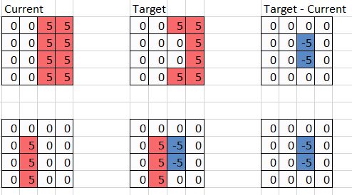

Table of Contents:
- [ToDos](#todos)
- [August 30, 2023](#august-30-2023)
- [July 06, 2023](#july-06-2023)
- [June 28, 2023](#june-28-2023)
- [June 21, 2023](#june-21-2023)
- [June 14, 2023](#june-14-2023)

## ToDos
!!! danger **High**
    1. [ ] [July 06, 2023: Running hyperparameter experiments using](#july-06-2023) [MLFlow](https://neptune.ai/vs/tensorboard-mlflow)
    2. [ ] [June 21, 2023: Run experiments with convolutional Observations/network](#june-21-2023)
    3. [ ] [June 14, 2023: Run hyperparameter experiments](#june-14-2023)

!!! warning **Medium**
    1. [ ] Task 1

!!! todo **Low**
    1. [ ] Task 1

!!! done **Completed**
    1. [ ] Task 1

## August 30, 2023
1. Use PPO on Tiny Env using CNNs
   1. 1d/2d Observations
   2.  

## July 06, 2023
!!! todo Running hyperparameter experiments using [MLFlow](https://neptune.ai/vs/tensorboard-mlflow)

## June 28, 2023
!!! note Jeff: Patch fix to reset bug in gym environments
    * [V0.2.3](https://dev.azure.com/CatDevelopment/1A%20Planning/_git/rl-sandbox?version=GT0.2.3)
    * Example showing why just using target - current isn't sufficient for solving terrain planning
        

            
           

        

## June 21, 2023
!!! todo Run experiments with convolutional Observations/network
    * Yaswanth: able to run PPO with convolution layers on grid_load_small environment. Arrived at a sub-optimal solution.
    * Built using `hodelbj2/conv2d-enviroments` branch for rl-sandbox.

## June 14, 2023
!!! todo Run Hyperparameter experiments
    For people running experiments please create a branch from [rl-sandbox-training](https://dev.azure.com/CatDevelopment/1A%20Planning/_git/rl-sandbox-training) with your user name as the prefix (ex: berryjk/grid_load_large_experiments).  Run what ever experiments you'd like and organize them in whatever way makes sense to you under the [experiments folder](https://dev.azure.com/CatDevelopment/1A%20Planning/_git/rl-sandbox-training?path=/experiments) on your branch.  Document your results and conclusions in markdown files along side the yaml files used to generate the results.  If you find it easier to document your conclusions in PowerPoint or Word then upload them to this [SharePoint](https://caterpillar.sharepoint.com/:f:/r/teams/CatDevelopmentGroup2/Shared%20Documents/1A%20Planning/10_Core%20Development/Cat%20RL%20Challenge%20Group/%5BADO%20608372%5D%20RL%20solutions%20to%20grid%20world%20terrain%20envs?csf=1&web=1&e=CDIp3P) folder.  Make sure to link back to your experimentation branch and make it clear which yaml files produced which results.  This link will also provide traceability to the tagged version of the RLLib and environments.  Ping this chat when you have interesting results to share.

    When you've found a set of hyper parameter tuning values that improve upon existing ones:

    1. Create a new branch for updating the default yaml files [ex: berryjk/update_default_model].
    2. Copy your best yaml file from your experimentation branch and replace the corresponding top level yaml file in the [experiments folder](https://dev.azure.com/CatDevelopment/1A%20Planning/_git/rl-sandbox-training?path=/experiments).  We don't want to merge all of your experiments and related folder structure into the main branch.
    3. Initiate a PR.  We'll verify reproducibility and complete the merge.
